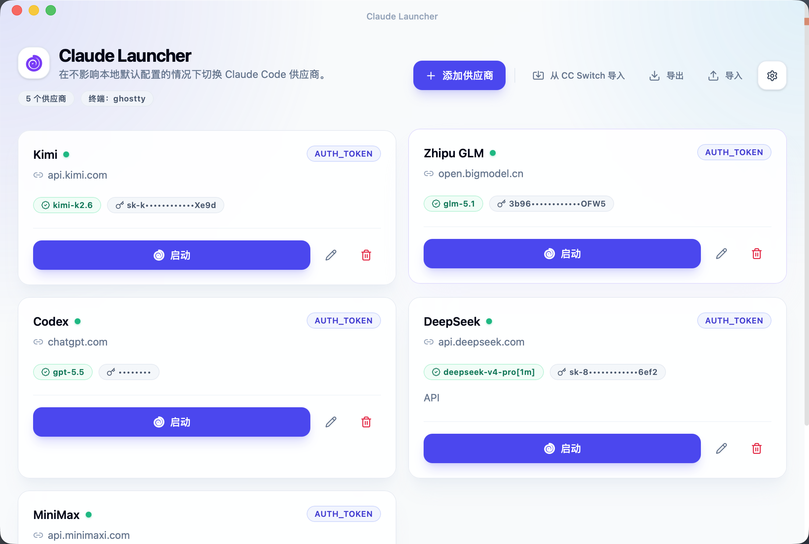

# Claude Launcher

在不影响本地默认配置的情况下，为 Claude Code 切换多个供应商。



## 功能

- **多供应商管理**：配置多个 Claude Code 供应商，每个都有独立的 Base URL、API Key、鉴权方式和模型。
- **零配置污染**：通过 `claude --settings` 启动，完全不修改你本地的 Claude Code 默认配置。
- **一键启动**：选择供应商后直接打开终端启动 Claude Code。
- **多终端支持**：支持 Terminal、iTerm2、Ghostty、Warp、Alacritty、Kitty。
- **导入导出**：导出/导入供应商配置（导出时自动脱敏 API Key）。
- **CC Switch 桥接**：一键导入 CC Switch 中已配置的 Claude 供应商。

## 技术栈

- Tauri 2.x + Rust
- React 19 + TypeScript
- Tailwind CSS
- Lucide React

## 安装

### 从 Release 下载

在 [Releases](https://github.com/blue-a11y/claude-launcher/releases) 页面下载最新版本的 `.dmg`，拖拽到 Applications 即可。

### 从源码构建

```bash
# 克隆仓库
git clone https://github.com/blue-a11y/claude-launcher.git
cd claude-launcher

# 安装依赖
npm install

# 开发模式
npm run tauri dev

# 构建 release
npm run tauri build
```

构建产物位于 `src-tauri/target/release/bundle/`。

## 使用

1. 打开 Claude Launcher
2. 添加供应商（填写 Base URL、API Key、模型等）
3. 点击「启动」打开终端并运行 Claude Code
4. 终端中运行 `/status` 即可看到当前使用的供应商配置

> 注意：Launcher 打开的 Claude Code 不会影响你本地默认的 Claude Code 配置。在 Launcher 之外新开的 Claude Code 仍然使用你的默认配置。

## 开发

### 项目结构

```
claude-launcher/
├── src/                      # 前端代码
│   ├── App.tsx
│   ├── components/           # React 组件
│   ├── hooks/                # 自定义 hooks
│   └── lib/
├── src-tauri/                # Tauri/Rust 后端
│   ├── src/lib.rs
│   ├── Cargo.toml
│   └── icons/
└── package.json
```

### 命令

| 命令 | 说明 |
|------|------|
| `npm run dev` | 启动前端 dev server |
| `npm run build` | 构建前端 |
| `npm run tauri dev` | 启动 Tauri dev 模式 |
| `npm run tauri build` | 构建 release 包 |

## 致谢

- [Claude Code](https://docs.anthropic.com/en/docs/agents-and-tools/claude-code/overview) — Anthropic 的官方 CLI 工具
- [Tauri](https://tauri.app/) — 构建跨平台桌面应用的框架
- [CC Switch](https://github.com/farion1231/cc-switch) — 供应商管理灵感来源

## License

MIT
